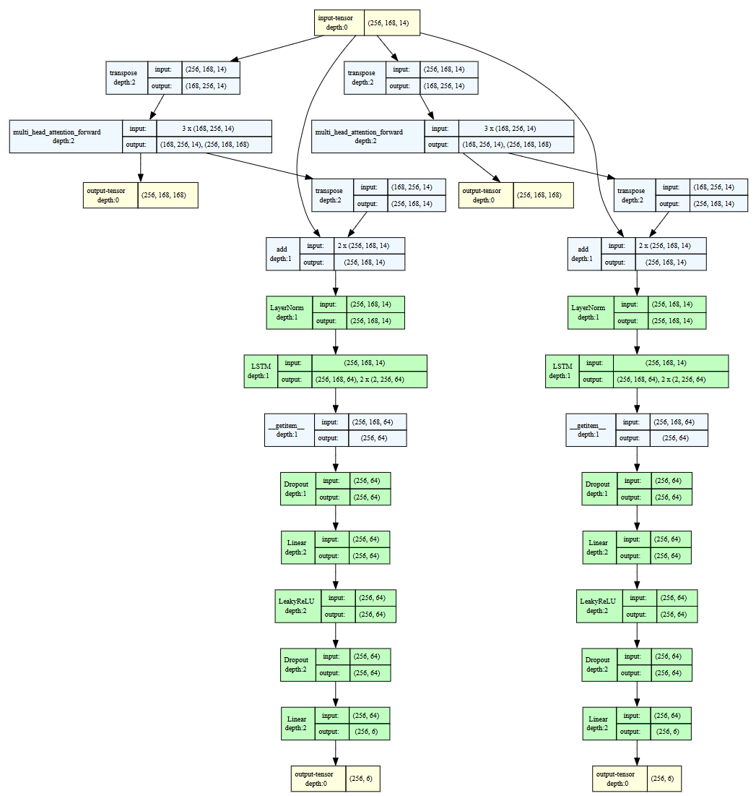
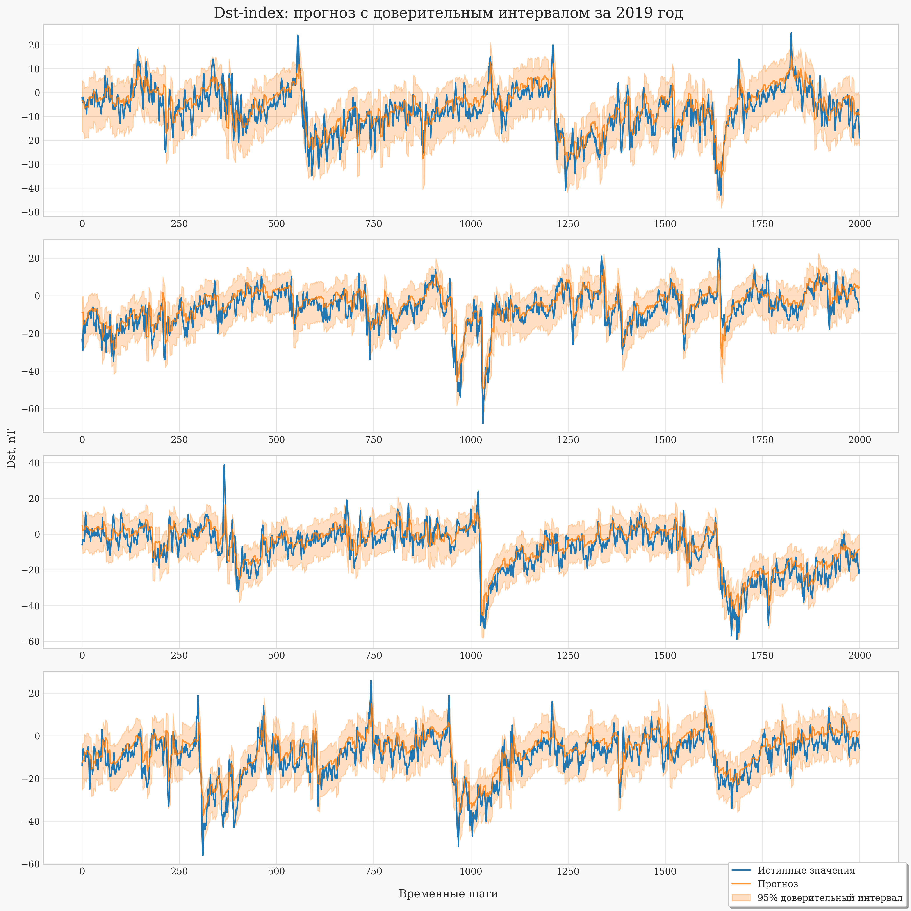
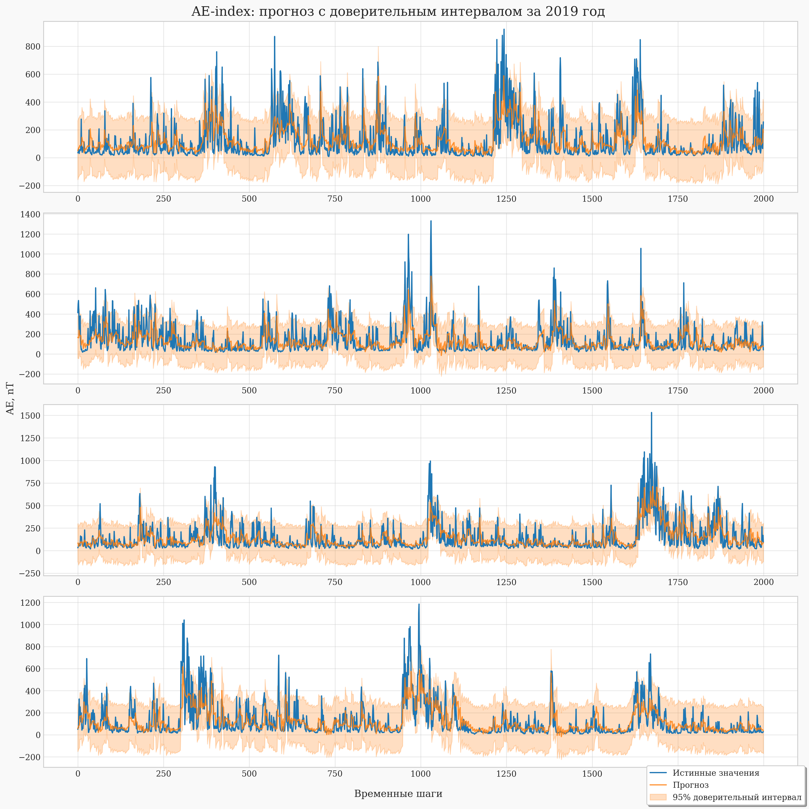
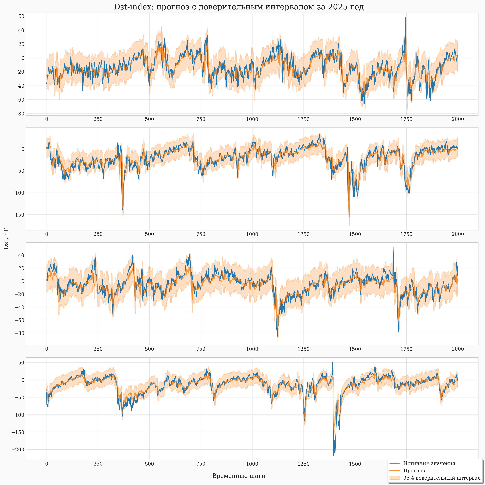
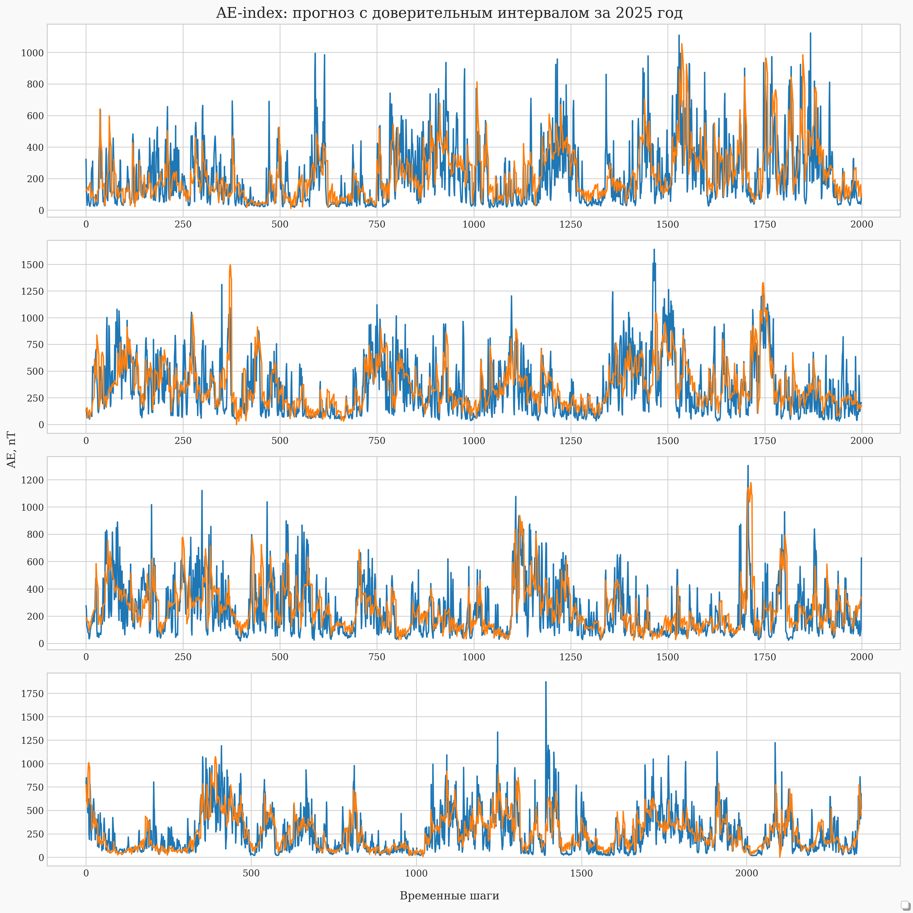

# Magnesis
> 🌎 Прогнозирование геомагнитных индексов Dst и AE на основе временных рядов параметров солнечного ветра для предсказания магнитных бурь и авроральной активности

## Источники данных

В ходе экспериментов, проверки гипотез и воспроизведения статей использовались данные из следующих источников:

| Источник | Описание |
|----------|----------|
| [OMNI 2 dataset (NASA)](https://spdf.gsfc.nasa.gov/pub/data/omni/) | [Документация](asserts/dataset_doc.txt) |
| [DTU Space Polar Cap](https://ftp.space.dtu.dk/WDC/indices/pcn/PCN_definitive/) | [Readme](https://ftp.space.dtu.dk/WDC/acknowledgements_and_readme.txt) |
| [Swiss Neutron Monitor Data](https://cosray.unibe.ch/data/nm/data/) | TODO |
| [Real-time Oulu NM count rate](https://cosmicrays.oulu.fi/) | TODO |\
> Для удобства, собрал все данные в [архив](https://huggingface.co/neZorinEgor/magnesis/blob/main/data.zip)

## Прогнозируемые индексы

- **Dst** (Disturbance Storm Time) - индекс кольцевого тока, характеризующий интенсивность геомагнитных бурь. Отрицательные значения указывают на ослабление геомагнитного поля из-за усиления кольцевого тока.

- **AE** (Auroral Electrojet) - индекс авроральной активности, отражающий возмущения в ионосферных токах в полярных областях. Используется для оценки магнитосферной активности и суббурь.

## Структура проекта
```txt
.
├── README.md
│
├── asserts/             # Визуализации и документация
│ └── ...               
│
├── data/                # Данные
│ ├── datasets/          # Готовые выборки (train/test)
│ ├── processed/         # Обработанные данные
│ ├── row/               # Сырые данные (jung, omni, oulu, pcn)
│ └── weights/           # Веса моделей (.pt)
│
├── magnesis/            # Основной модуль библиотеки
│ ├── constants.py
│ ├── core.py
│ ├── dataset.py
│ ├── model.py
│ ├── train.py
│ ├── utils.py
│ └── validator.py
│
├── notebooks/           # Jupyter ноутбуки
│ ├── articles/          # Воспроизведение статей
│ ├── examples/          # Примеры использования
│ └── time_series_net/   # EDA и эксперименты по обучению
│
├── pyproject.toml       # Зависимости проекта
└── uv.lock              # Lock-файл зависимостей
```

## Описание модели
**`GeomagneticNet`** — это нейросетевая архитектура для прогнозирования геомагнитных индексов Dst (кольцевой ток) и AE (авроральный электроджет) на основе параметров солнечного ветра.

Модель представляет собой двухветочную архитектуру с раздельными вниманиями и рекуррентными слоями для каждого индекса:


### Размер модели

* Общее количество параметров: ~110 тыс
* Входное окно: 168 часов (7 дней)
* Горизонт прогноза: 6 часов

### Описание входных признаков модели

Модель использует **14 параметров** для прогнозирования геомагнитных индексов Dst и AE.

### Параметры межпланетного магнитного поля (IMF)

| Признак | Описание | Единицы измерения |
|---------|----------|-------------------|
| `Bz_GSM` | Компонента ММП по оси Z в GSM-системе | nT |
| `By_GSM` | Компонента ММП по оси Y в GSM-системе | nT |
| `Bx_GSE` | Компонента ММП по оси X в GSE-системе | nT |

#### Параметры солнечного ветра

| Признак | Описание | Единицы измерения |
|---------|----------|-------------------|
| `T_proton` | Температура протонов | K |
| `Np_density` | Плотность протонов | cm⁻³ |
| `V_plasma` | Скорость плазмы | km/s |
| `V_Long_GSE` | Продольная компонента скорости в GSE | km/s |
| `V_Lat_GSE` | Широтная компонента скорости в GSE | km/s |

#### Геомагнитные индексы

| Признак | Описание | Единицы измерения |
|---------|----------|-------------------|
| `Kp` | Планетарный индекс геомагнитной активности | Kp (0–9) |
| `AL` | Утренний сектор авроральной электроструи | nT |
| `AU` | Вечерний сектор авроральной электроструи | nT |
| `f10.7` | Поток радиоизлучения Солнца (10.7 см) | sfu |

#### Целевые переменные

| Признак | Описание | Единицы измерения |
|---------|----------|-------------------|
| `Dst` | Индекс кольцевого тока (Disturbance Storm Time) | nT |
| `AE` | Индекс авроральной электроструи (Auroral Electrojet) | nT |

> **Примечание:** Признаки `Dst` и `AE` также используются как входные (история 168 часов), но при реальном прогнозе подаются только измерения солнечного ветра.


### Данные

* Параметры солнечного ветра и геомагнитные индексы из открытых баз данных (NASA/OMNI, WDC Kyoto)
* Частота: почасовые измерения
* Временной период: 1995–2025 гг.

### Предобработка

* Замена пропусков (fill values: 999.9, 99999, 9999999...) → NaN
* Интерполяция методом PCHIP
* Логарифмическое преобразование AE (log1p) для нормализации распределения
* Масштабирование признаков: StandardScaler
* Масштабирование целевых переменных: MinMaxScaler (range = [-1, 1])

### Разделение данных

| Датасет | Период | Размер (часы) | Назначение |
|---------|--------|---------------|------------|
| Train / Validation | 1995 – 2018 | ~210,000 | Обучение (90%) и валидация (10%) |
| Test 2019 | 2019 | ~8,760 | Тестирование на минимуме солнечной активности |
| Test 2025 | 2025 | ~8,760 | Тестирование на максимуме солнечной активности |
> Примечание: Разделение выполнено строго хронологически без перемешивания для корректной оценки на временных рядах.

### Результаты

#### AE (Auroral Electrojet)

| Период | Горизонт (часы) | RMSE (nT) | MAE (nT) | MAPE (%) |
|--------|----------------|-----------|----------|----------|
| **2019 (минимум)** | 1 | 107.75 | 68.53 | 87.33 |
| | 3 | 85.40 | 55.95 | 68.29 |
| | 6 | 67.66 | 44.77 | 51.44 |
| **2025 (максимум)** | 1 | 187.89 | 133.93 | 84.57 |
| | 3 | 151.52 | 108.88 | 64.49 |
| | 6 | 121.59 | 87.78 | 48.59 |

#### Dst (Disturbance Storm Time)

| Период | Горизонт (часы) | RMSE (nT) | MAE (nT) | MAPE (%) |
|--------|----------------|-----------|----------|----------|
| **2019 (минимум)** | 1 | 5.87 | 4.43 | ~1.93e8* |
| | 3 | 5.29 | 4.04 | ~5.32e15* |
| | 6 | 4.57 | 3.56 | ~1.84e15* |
| **2025 (максимум)** | 1 | 11.64 | 7.57 | ~1.70e8* |
| | 3 | 10.63 | 6.91 | ~4.52e15* |
| | 6 | 9.45 | 6.26 | ~2.64e14* |
> *Примечание: MAPE для Dst имеет аномально высокие значения из-за близости индекса к нулю в спокойные периоды. Рекомендуется использовать RMSE и MAE как основные метрики для Dst.

## Пример использования
```python
import pandas as pd
import matplotlib.pyplot as plt
from magnesis import GeomagneticNet

# загрузка модели
model = GeomagneticNet(model_dir="./weights", device="cuda")

# загрузка данных
geomagnesis_data = pd.read_csv("../data/datasets/test_2025.csv")

# прогноз / валидация
result = model.validate(geomagnesis_data, batch_size=32)
```
**[Полный пример использования](notebooks/usage_example.ipynb)**

На графиках представлено сравнение предсказанных (оранжевый) и фактических (синий) значений индексов `Dst` и `AE` за 2019 и 2025 годы.

| Dst (2019) | AE (2019) |
|:---:|:---:|
|  |  |

| Dst (2025) | AE (2025) |
|:---:|:---:|
|  |  |

